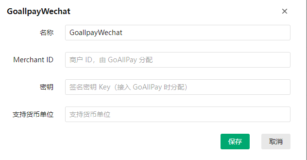

<h1 align="center">GoAllPay微信</h1>

#### 1.使用前置：业务系统--->应用--->插件列表--->下载GoALLPay微信

应用下载方式与支付宝网页支付插件相同，[支付宝网页支付安装](Alipayweb.md)

#### 2.使用配置：请前往[GoAllPay官方平台](https://goallpayx.com/cn/contact.html)注册好账号

GoAllPay微信和[GoAllPay银联](./GoAllPay银联.md)类似

其中的merchant id（商户ID）需要注册好之后，由GoAllPay分配

密钥为双方约定的签名密钥 Key（接入 GoAllPay 时分配）

