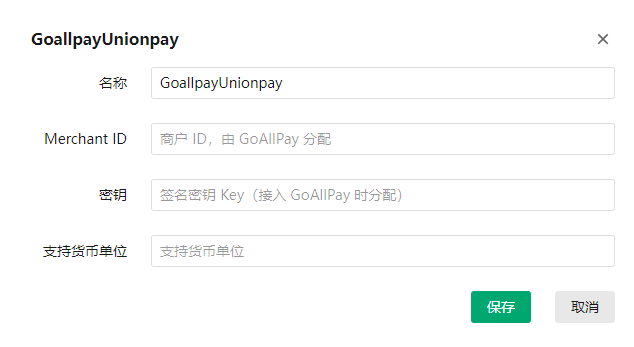

<h1 align="center">GoAllPay银联</h1>

#### 1.使用前置：业务系统--->应用--->插件列表--->下载GoALLPay银联

应用下载方式与支付宝网页支付插件相同，[支付宝网页支付安装](Alipayweb.md)

#### 2.使用配置：请前往[GoAllPay官方平台](https://goallpayx.com/cn/contact.html)注册好账号

在支付接口中对GoAllPay进行配置



其中的merchant id（商户ID）需要注册好之后，由GoAllPay分配

密钥为双方约定的签名密钥 Key（接入 GoAllPay 时分配）

```
1. 将所有传入参数（除 signature 参数外）按照参数名的 ASCII 码从小到大排序后（字典序），使用 URL 键值对的格式（即 key1=value1&key2=value2...）拼接成字符串 string1。
2. 在 string1 最后直接拼接（不需要用“&”连接）双方约定的签名密钥 Key（接入 GoAllPay 时分配），得到 stringSignTemp 字符串，并对 stringSignTemp 进行加密运算（加密算法以参数signType值为准），得到 signature 的值。
3. 签名示例：
string1: OsType=IOS&OsVersion=&acqID=99020344&backURL=https://testapi.allpayx.com/test&charSet=UTF-8&detailInfo=W3siZ29vZHNfbmFtZSI6ICJhcHBsZSIsICJxdWFudGl0eSI6ICIyIn1d&frontURL=http://example.com&goodsInfo=apple&logisticsStreet=上海市浦东新区xx路xx号xxx室&merID=merchant_id&merReserve=&orderAmount=1&orderCurrency=CNY&orderNum=20220620171733&paymentSchema=UP&signType=SHA256&tradeFrom=H5&transTime=20220620171733&transType=PURC&userID=user01&userIP=114.91.1.243&version=VER000000005

stringSignTemp: OsType=IOS&OsVersion=&acqID=99020344&backURL=https://testapi.allpayx.com/test&charSet=UTF-8&detailInfo=W3siZ29vZHNfbmFtZSI6ICJhcHBsZSIsICJxdWFudGl0eSI6ICIyIn1d&frontURL=http://example.com&goodsInfo=apple&logisticsStreet=上海市浦东新区xx路xx号xxx室&merID=merchant_id&merReserve=&orderAmount=1&orderCurrency=CNY&orderNum=20220620171733&paymentSchema=UP&signType=SHA256&tradeFrom=H5&transTime=20220620171733&transType=PURC&userID=user01&userIP=114.91.1.243&version=VER000000005key

signature: 40f1e5adebba58cc7822dac0b3a2bfebb6676e245370be027cdfb952695bee29
```

以上示例中，stringsigntemp中的最后的 ***`key`*** 就是密钥
最后的货币单位请自行填写`HKD`或`USD`等
更加详细的信息可以查看API文档：[GoAllPay在线支付接入规范文档V5.2.3](https://git.allpayx.com/OpenAPI/common/src/master/AllPay_Integration_Specification_CH.md#goallpay%E5%9C%A8%E7%BA%BF%E6%94%AF%E4%BB%98%E6%8E%A5%E5%85%A5%E8%A7%84%E8%8C%83%E6%96%87%E6%A1%A3v523)

