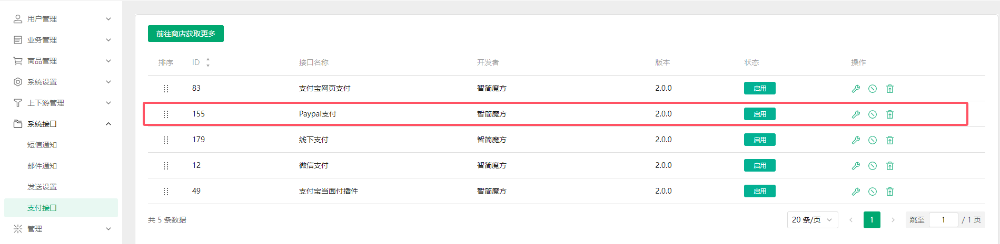
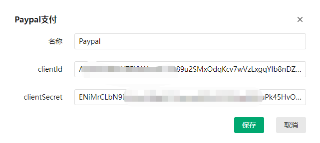

<h1 align="center">PayPal支付</h1>

#### 1.使用前置：业务系统--->应用--->插件列表--->下载PayPal支付

应用下载方式与支付宝网页支付插件相同，[支付宝网页支付安装](Alipayweb.md)

#### 2.使用配置：请提前注册好PayPal账号

然后和前面相同，直接从**系统接口--->支付接口--->PayPal支付**进行配置

配置PayPal支付需要的信息：

ClienID和ClientSecret的获取可以参考一下该[申请教程](https://www.fecify.com/doc/cn-1.0/fecify-shop-helper-paypal-get-client-id-and-secret.html)

