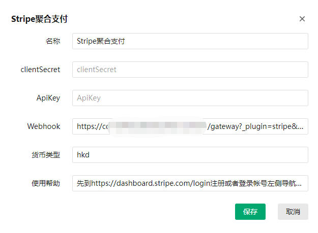
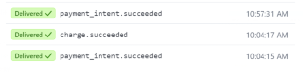
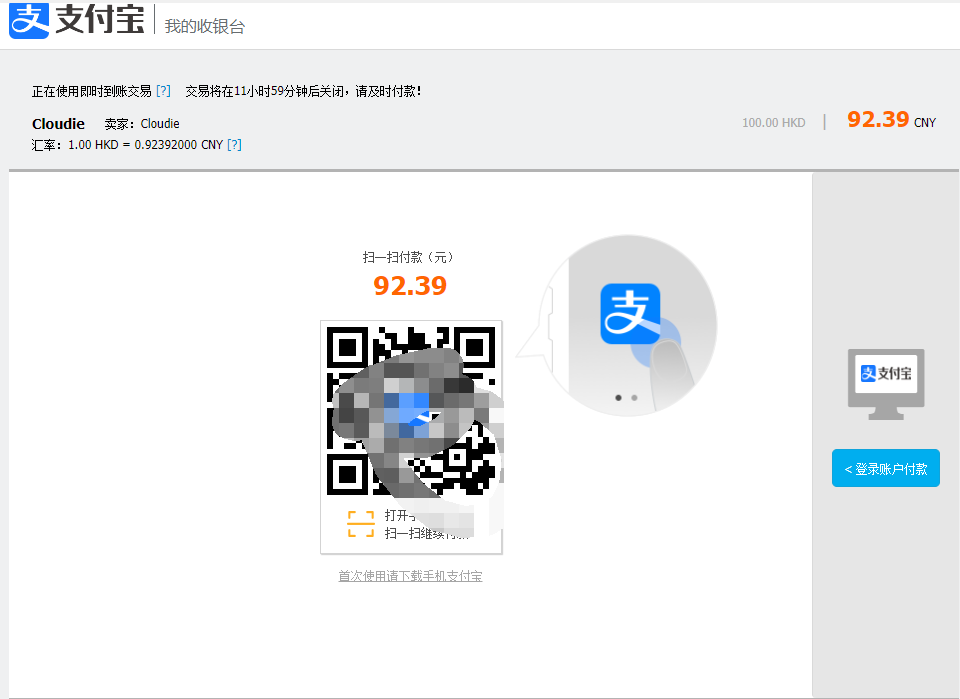

<h1 align="center">Stripe聚合支付</h1>

#### 1.使用前置：业务系统--->应用--->插件列表--->下载Stripe聚合支付

应用下载方式与支付宝网页支付插件相同，[支付宝网页支付安装](Alipayweb.md)

#### 2.使用配置：请提前前往[Stripe](https://dashboard.stripe.com/login)签约并创建对应应用

先到https://dashboard.stripe.com/login注册或者登录帐号左侧导航开发者获取API密钥（pk开头的为clientSecret，sk开头的为ApiKey）左侧导航Webhook，然后创建或者更新端点为上面WebHook里的地址（上面是我们的测试网站域名，请根据实际情况填写自己的域名）

准备好之后请检查Stripe的事件是否齐全，包括以下事件

> 
>
> checkout.session.completed

配置好之后就可以使用Stripe进行支付了（这里以支付宝为例，给还可以添加其他支付方式）。如果有其他问题可以查询[帮助手册](https://help.shopyy.com/html-n443.html)

