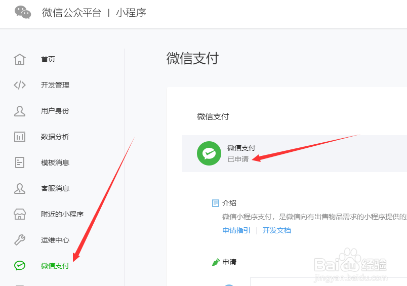

<h1 align="center">微信H5支付</h1>

#### 1.使用前置：业务系统--->应用--->插件列表--->下载微信H5支付

应用下载方式与支付宝网页支付插件相同，[支付宝网页支付安装](Alipayweb.md)

#### 2.使用配置：请提前前往[微信支付签约](https://pay.weixin.qq.com/static/applyment_guide/applyment_detail_website.shtml)

1. **APPID/AppSecret**

   登录【[微信公众平台](https://mp.weixin.qq.com/)】，在【开发】-【基本配置】中查看。

   

2. **商户号MerchantId/商户支付密钥Key**

   - 登录【[微信公众平台](https://mp.weixin.qq.com/)】，确认【微信支付】的状态是【已申请】。否则请按照后台的提示进行申请，这个过程一般需要若干个工作日才能完成。

     

   - 在你申请的过程中，会收到一封来自微信支付的邮件。邮件名称类似《恭喜您成功通过微信支付商户资料审核》。邮件内容类似下图，图中有三个信息：【微信支付商户号】【商户平台登录帐号】【商户平台登录密码】其中“微信支付商户号”就是我们需要的【商户号MerchantId】

     

   - 获取后，进入【[微信支付平台](https://pay.weixin.qq.com/index.php/core/home/login?return_url=/)】点击【账户中心】-【API安全】

   - 进入API安全管理的页面。如果页面提示你安装操作证书一类的，就按照提示安装，然后重新进入这个页面。

   - 然后在该页的【API密钥】部分，点击【设置密钥】，可以看到密钥内容，该密钥就是我们需要的【商户支付密钥Key】

更详细配置教程请查看[微信支付官方文档](https://pay.weixin.qq.com/wiki/doc/apiv3/open/pay/chapter2_6_1.shtml)

